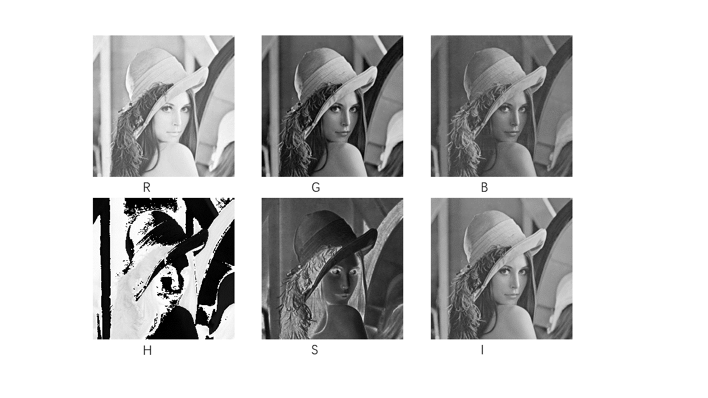
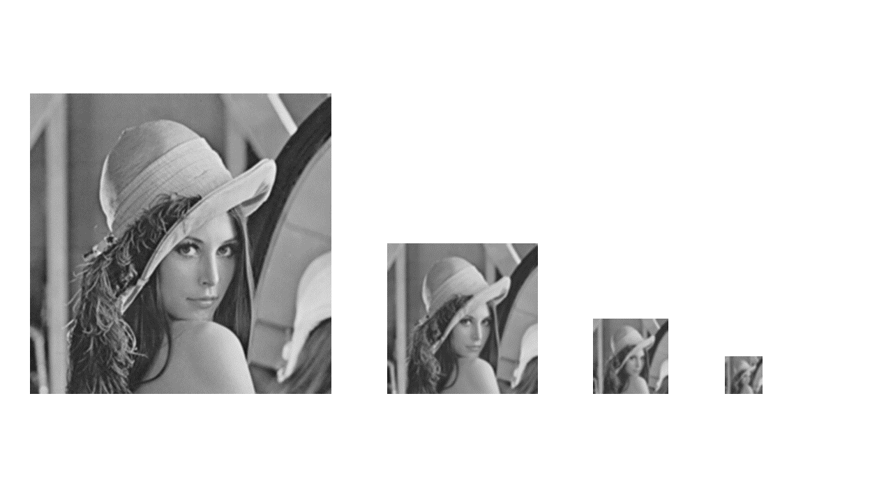
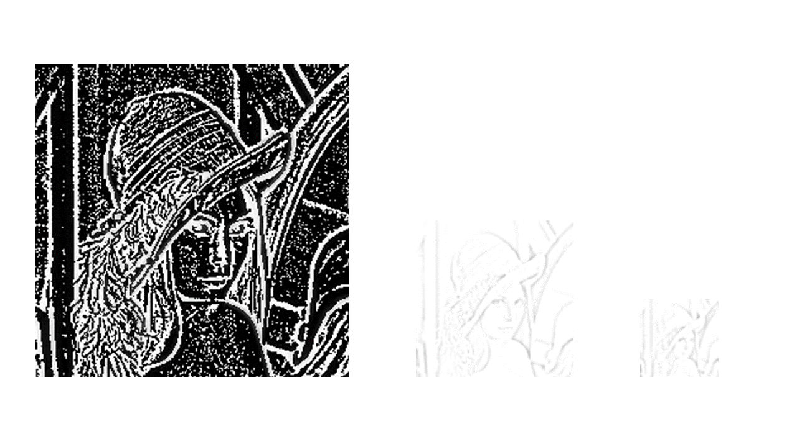
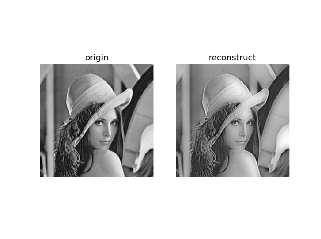
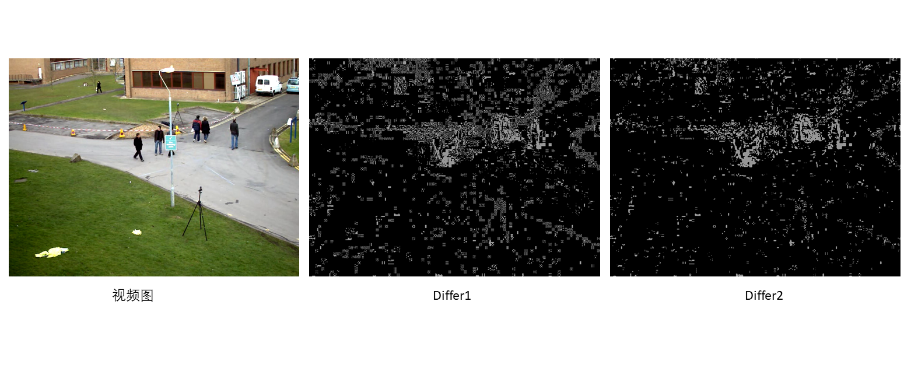
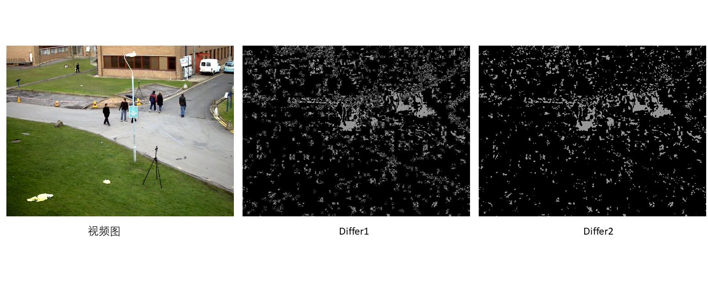

# 数字图像处理大作业

## 

## 一、基本题

### 十二、彩色图像处理：

1. > 将Lena_color.bmp从RGB空间转到HSI空间

   根据HSI转换的公式：
   $$
   \begin{align}
   H&=\begin{cases}
   arccos(\frac{R-G+R-B}{2\sqrt{(R-G)^2+(R-B)(R-G)}}) & R\neq G \space or \space R\neq B\\
   2\pi - arccos(\frac{R-G+R-B}{2\sqrt{(R-G)^2+(R-B)(R-G)}}) &B>G
   \end{cases}\\
   S&=1-\frac{3}{R+G+B}min(R,G,B)\\
   I&=\frac{R+G+B}{3}
   \end{align}
   $$
   可以实现将图像从RGB到HSI空间的转换。代码如下：

   ```python
   def HSI(img):
       ## RGB-->HSI
       img = img.astype(np.float32)
       print(img.dtype)
       I = np.mean(img,axis=2)
       S = 1-3*np.min(img,axis=2)/np.sum(img,axis=2)
       H = np.zeros(I.shape)
   
       def calc_H(channel):
           [B,G,R] = channel
           H = np.arccos((2*R-G-B)/2/np.sqrt((R-G)**2+(R-B)*(G-B)))
           if B>G:
               H = 2*np.pi-H
           return H
       
       for i in range(H.shape[0]):
           for j in range(H.shape[1]):
               H[i,j] = calc_H(img[i,j,:])
   
       return (H,S,I)
   ```

   结果如下所示：

   其中将$H$的值从$(0,2\pi)$线性映射到$(0,255)$的区间上，将$S$的值从$(0,1)$映射到$(0,255)$上，即：
   $$
   H'=H\times\frac{255}{2\pi},S'=S\times255
   $$

2. > 使用上述转换后的I通道图像，自选变换函数进行伪彩色处理

   采用如下映射函数：
   $$
   \begin{align}
   R&=f\\
   G&=255-\frac{4}{255}(f-127.5)^2\\
   B&=255-f
   \end{align}
   $$
   代码如下：

   ```python
   def map2RGB(f):
       # 灰度映射到RGB函数
       R = f
       G = 255-4/255*(f-127.5)*(f-127.5)
       B = 255-f
       img = np.array([B,G,R]).transpose(1,2,0)
       return img.astype(np.uint8)
   ```

   可以得到如下结果：

   

   可以看出随意的变换函数不可取，映射或图像非常不自然，需要仔细挑选映射函数才好。

3. > 对原始图像的S通道进行饱和度增强

   通过将之前图像的S通道图像乘一个系数达到饱和度增强的效果，为此需要完成从HSI空间到RGB的转换，HSI转RGB代码如下：

   ```python
   def HSI2RGB(channel):
       # 将HSI单通道转为RGB通道
       H,S,I = channel
       R,G,B = 0,0,0
   
       if H < 2/3*np.pi:
           B = I*(1-S)
           R = I*(1+(S*np.cos(H))/np.cos(np.pi/3-H))
           G = 3*I-B-R
       elif 2/3*np.pi <= H and H < 4/3*np.pi:
           R = I*(1-S)
           G = I*(1+(S*np.cos(H-2/3*np.pi))/np.cos(np.pi-H))
           B = 3*I-G-R
       elif 4/3*np.pi <= H and H <= 2*np.pi:
           G = I*(1-S)
           B = I*(1+(S*np.cos(H-4/3*np.pi))/np.cos(5/3*np.pi-H))
           R = 3*I-B-G
       
       return (R,G,B)
   ```
   
   效果图如下（分别为原图像、HSI转换到RGB图像、1.1倍饱和度、0.6倍饱和度图像）：
   
   
   
   从上可以看出，饱和度越大，色彩更艳丽。而饱和度越低，色彩越平淡。


### 十三、多尺度图像处理：

1. > 利用15.2.6所示的双线性滤波器组成的5x5高斯平滑滤波器对Lena.bmp进行3层高斯金字塔分解

   由题意，每次循环时，对图像线进行高斯滤波，随后进行降采样，得到新一层的高斯图像。具体代码为：

   ```python
   def gaussian_pyramid(img,kernel,T):
       im_list = [img]
       for i in range(T):
           im_list.append(down_sample(imfilter(im_list[-1],kernel)))
       return im_list
   ```

   高斯核为$K=\frac{1}{64}[1,2,2,2,1]^T\cdot [1,2,2,2,1]$结果如下：

   

   从左到右分别为0层（原图像），1/2/3层。

2. > 对上一步的金字塔对图像进行重建

   欲重建图像，还需3层拉普拉斯图像。根据课件上的内容，拉普拉斯图像近似为相邻两个高斯图像的差，故而对第k+1层高斯图像进行上采样后，与第k层的高斯图像相减，得到第k层的拉普拉斯图像。（**个人认为课本上的先进行上采样再通过拉普拉斯滤波器这个内容有问题**，本身拉普拉斯图像输出的就是残差，基本上为高频分量，如果通过拉普拉斯滤波器再进行相减，则会保留非常多的低频分量。通过实验发现这样做出来的拉普拉斯图像基本和高斯图像差不多，和课本上的结果非常不一样。）

   搜索资料后，大致了解了拉普拉斯金字塔正确的生成方式，思路为，将图像行列扩为原来2倍，多出来的行列为0，随后将拓展的图像与之前高斯核乘4卷积，得到上采样后的图像，随后用高斯图像减去上采样图像即可得到拉普拉斯金字塔。具体代码如下：

   ```python
   def laplace_pyramid(gaussian_list,kernel):
       #gaussian_list为高斯金字塔列表
       #函数返回拉普拉斯金字塔列表
       im_list = []
       for i in range(len(gaussian_list)-1):
           gauss1 = gaussian_list[i]
           gauss2 = gaussian_list[i+1]
           im_list.append(im_add(gauss1,-imfilter(up_sample(gauss2),kernel)))
       return im_list
   ```
   
   拉普拉斯金字塔结果如下：
   
   
   
   有了高斯金字塔与拉普拉斯金字塔后，重建图像就显得简单了。先将第k+1层高斯图像上采样，随后与第k层拉普拉斯图像相加，即可得到第k层高斯图像。重建代码如下：

   ```python
def reconstruct_img(gaussian_img,laplace_list,kernel):
       img = None
    for i in range(len(laplace_list)):
           l_im = laplace_list[-i-1]
        gaussian_img = im_add(imfilter(up_sample(gaussian_img),kernel),l_im)
       return gaussian_img
   ```
   
   重建图如下：
   
   



可以看出总体重建效果还不错，但是还是肉眼可见误差，说明在构建金字塔过程中存在着信息的丢失，导致还原度不佳。


## 二、综合题——视频背景提取/滤除

### 1.常用算法介绍

1. **Frame Difference**：

   该方法通过视频帧的加权平均获得背景图，为了避免噪声、环境亮度变化的干扰，其背景帧被实时维护、不断更新。算法描述如下：

   给定视频帧$V=\{Z_1,Z_2,...,Z_l\}$，初始化时，设定背景帧为$B_1=\frac{1}{l}\sum_{t=1}^l Z_t$，在t时刻，其背景帧为$B_t=(1-\alpha)B_{t-1}+\alpha Z_t$，从而实现背景的动态更新。在前景检测时，计算$B_t$与$Z_t$的绝对差值，若值大于阈值则认为是前景。

   该算法优点在于通过不断的更新，使得模型的自适应性加强，可以适应光照强度改变等情况，且方法简单易实现。缺点在于无法应用到运动的摄像头上。

2. **多帧平均法**：

   该法将背景帧认为是多帧的平均值，即$B_n=\frac{1}{N}\sum_{t=n-N+1}^{n}Z_t$，从而得到背景模型。为了克服光线干扰，需不时进行更新$B_n=B_{n-1}+\frac{1}{N}(Z_n-Z_{n-N})$，前景提取则类似于**Frame Difference**中的方法。

3. **CodeBook:**

4. **Gaussian Mixture Model:**

   该方法基于混合高斯模型，将像素的分布建模为一个混合高斯模型，通过视频帧的训练，得到一个含K个高斯分布的模型，每个高斯分布的权重为$w_k$，K个高斯分布按照fitness value $w_k/\sigma_k$的值进行从大到小排序（fitness value越大，分布越可能是背景像素的分布）。当新的像素来到时，将像素值$z_t$与各个高斯模型的均值$\mu_k$进行比较，若其与前B个分布中的任何一个匹配（$|z_t-\mu_k|<3\sigma_k$），则可以认为该像素为背景像素，否则为前景像素。其中B定义为$B=argmin_k\{\sum_{i=0}^kw_i>T\}$。当然，在实际应用中，每得到一个新帧，需要对模型进行更新。

5. **ViBe**：

   该方法为每个位置的像素点保存一个样本集$M(x)=\{v_1,v_2,...,v_N\}$，定义$v(x)$为x处的像素值，则判断该像素是否为背景的依据时：$ M(x) \cap  S_R(v(x))$的元素数量大于阈值$min$，其中$S_R(v(x))$为像素点$v(x)$以$R$为半径的区域。相当于逐个比较$M(x)$中的样本到$v(x)$的距离，若全部比较后，小于$R$的样本数大等$min$则判为背景。

   模型初始化方法为：对于$x$，随机选取其邻居像素作为样本值，即$M_0(x)=\{v(y)|y\in NG(x)\}$，$NG(x)$为邻居点。

### 2.帧差法检测运动目标：

教材中的算法为，计算两帧之间的差值$D_{i}(x,y)=|f_{i}(x,y)-f_{i-1}(x,y)|$，若$D_i(x,y) >T$，则认为$(x,y)$处为运动物体（前景）。在程序中我实时显示两帧间的差值的二值图$Differ1$以及中值滤波得到的$Differ2$。在实践中，发现自己写的中值滤波代码运行速度感人，故而我只是实现了中值滤波代码，实际的运行代码中直接调用**opencv** 的中值滤波函数**medianBlur**。在阈值为80，中值滤波窗为$3\times 3$的情况下，结果如下：



可以看出，噪声非常之大，就算对Differ1做中值滤波，效果也不大好，且经过多次试验，就算将阈值取到相当大，噪声效果依旧。当然，运动物体的轮廓还是可以大致描述的。为了克服以上问题，我们先将视频转为灰度图，并先做一次中值滤波，得到结果如下：



感觉没有什么改变，甚至Differ的物体轮廓开始扭曲，这种噪声看来不是椒盐噪声，个人认为产生这种问题的原因在于摄像头的微扰，导致$(x,y)$并非完全对应现实中的单一位置，从而导致像素在一些值之间不断变化，故而直接相减并非对应同一个位置的像素差值。看来还需要其他方法来解决噪声问题（比如三帧差分法）。但是时间不足，不再研究。


### 3. 帧平均法提取视频背景与前景

在此我们可以认为背景图$B_n$为近$N$帧的视频帧的平均值，前景图即为将视频帧$f_n$减去背景帧$B_n$后二值化的图。背景图更新采用如下策略：$B_n = (1-\alpha)B_{n-1} + \alpha f_n$。结果如下：


可以看出该算法效果非常之好，背景图可以较好地表现近一段时间不动的物体。且前景图可以完好地将运动物体分割出来。但是依旧存在一些问题，即视频中存在着人移动速度较快的情况，这种情况下前景图中检测出的运动物体容易有'残影'。


### 4. MOG算法

在此描述一下MOG算法的主要流程：

对于像素$x_t$，设其服从多峰高斯分布，有$p(x_t)=\sum_{j=1} ^K w_jN(x_t;\mu_j ^t,\Sigma_j^t)$，其中$\mu_j^t,\Sigma_j^t$为第j个高斯分布的均值与协方差矩阵，且有假设$\Sigma_j^t = (\sigma_j^t)^2I$。将$K$个高斯分布按照$w_k^t/\sigma_k^t$进行从大到小排序，前B项认为是背景像素的分布，其中$B=argmin_b\{\sum_{j=1}^b w_j^t > T\}。$在时刻t，对于像素$x_t$，若其与前B项分布中的任意一项匹配（$|x_t-\mu_j^t|<2.5\sigma_j^t$，则认为其为背景像素，否则为前景像素。

当像素与任意一个分布匹配时，需要将分布进行如下更新：
$$
\begin{align}
w_k^{t+1} &= (1-\alpha)w_k^t+\alpha p(w_k^t|x_t)\\
\mu_k^{t+1}&=(1-\alpha)\mu_k^t + \rho x_t\\
\Sigma_k^{t+1}&=(1-\alpha)\Sigma_k^t + \rho (x_t-\mu_k^{t+1})(x_t-\mu_k^{t+1})^T\\
\rho&=\alpha N(x_t;\mu_k^t,\Sigma_k^t)\\
p(w_k^t|x_t)&=\begin{cases}
1 & w_k^t \space is \space first \space match\\
0 & else
\end{cases}
\end{align}
$$
若不存在匹配，则将最不可能的分布（即$w_k^texp(-\frac{（x_t-\mu_k^t)^2}{2\sigma_k^t})$最小）替换为新分布$\mu_K^t = x_t, \Sigma_K^t = \sigma^2I$，权值变为一个很低的值（$1/N$，$N$为已采样数）。在算法初始化时，设第一个分布为$N(x_1,\sigma^2I)$，权值设为1。算法仅需设置阈值$T$与$K$以及学习率$\alpha$。


## 三、文件清单：

| file              | function             |
| ----------------- | -------------------- |
| color_process1.py | 十二题1问代码        |
| color_process2.py | 十二题2问代码        |
| color_process3.py | 十二题3问代码        |
| pyramid.py        | 第13题代码           |
| frame_diff.py     | 背景提取——帧间差分法 |
| frame_average.py  | 背景提取——帧平均法   |
| MOG.py            | 背景提取——混合高斯   |

